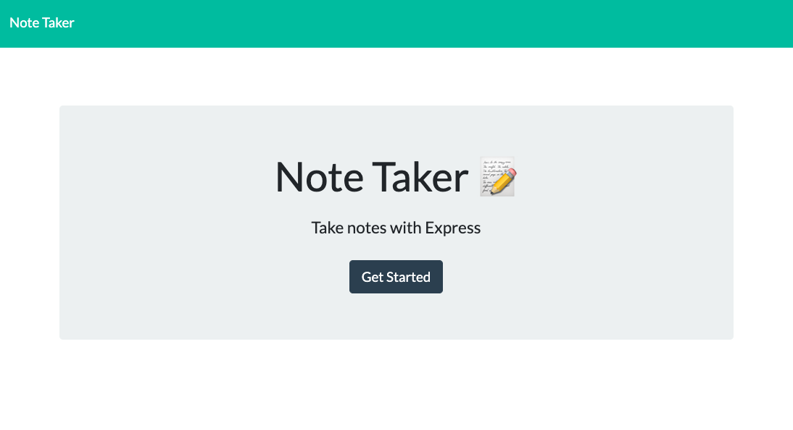
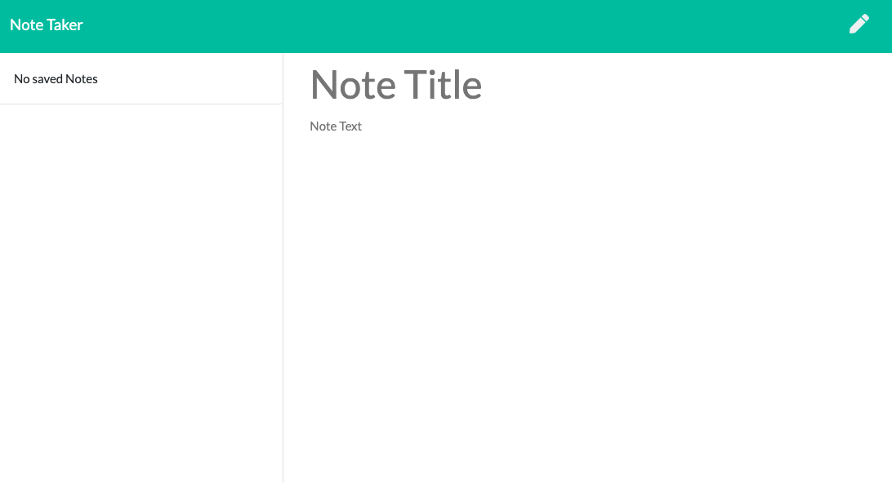
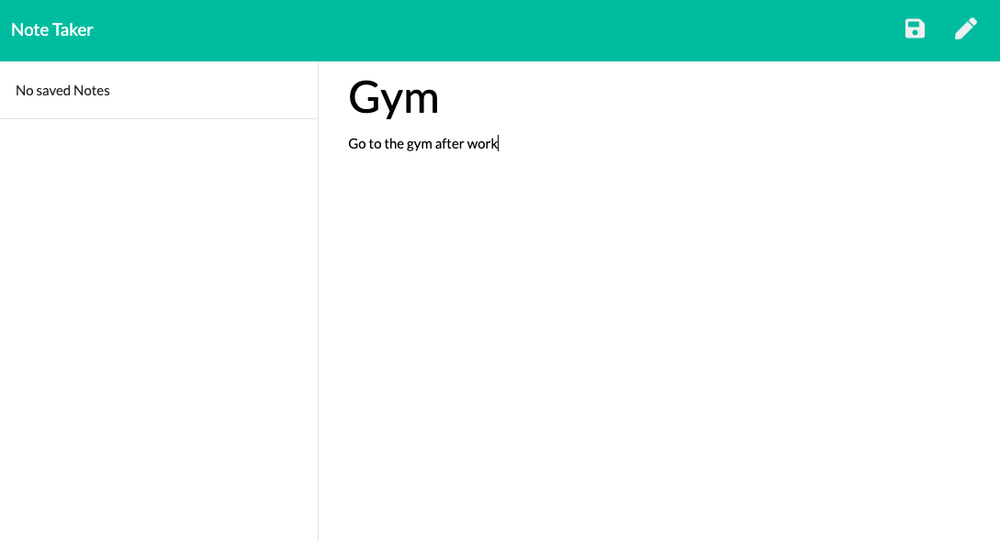
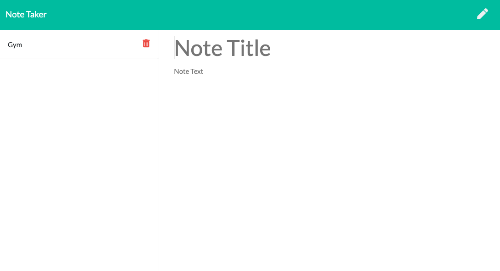
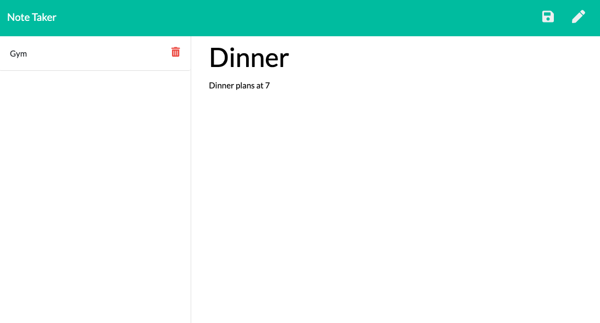
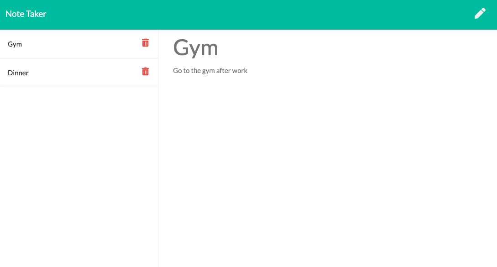
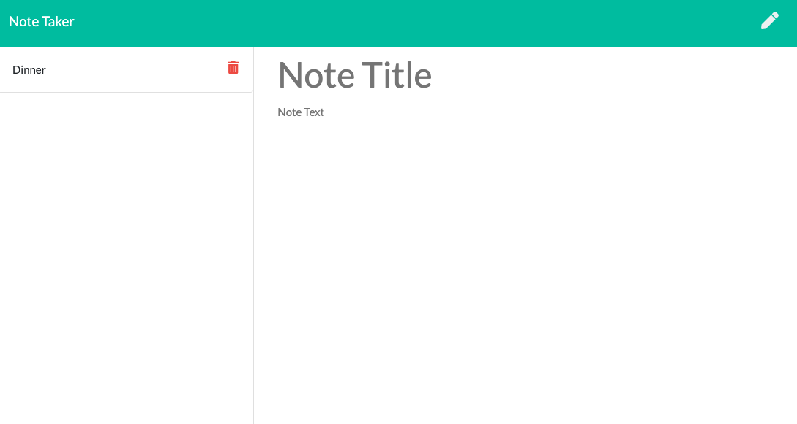

# Note-Taker

## About:
As the schedule of the modern day worker becomes more and more inundated with small tasks and events, keeping track of a thought processes is more important than ever. This Note-Taker app was created to help alleviate the modern day consumer from some of the daily burden of tracking one's thoughts. 

Using NodeJS in conjunction with ExpressJS, JavaScript. HTML, and CSS, this app is able to take in a user's task with a description and save it. It can then recall old tasks, or delete accomplished tasks based on the user's preferences. Using this Note-Taker app stands to make keeping tack of one's thoughts more accessible and easier than ever before.

## Index
1) [About](#About)
1) [Installation](#Installation)
2) [Usage](#Usage)
3) [Contributors](#Contributors)
4) [GitHub](#GitHub)
5) [Screenshots](#Screenshots)

## Installation:
Please Enter "npm i" into your command line to install all dependencies

## Usage:
Go to the launched site at https://mighty-meadow-89543.herokuapp.com/ to access the app.

## Contributors:
Andrew Kleiner

## GitHub: 

### GitHub Username:
akleiner26

### GitHub Repo:
https://github.com/akleiner26

### GitHub Photo:
 

### GitHub Email:
AndrewJKleiner@gmail.com

## Screenshots:
### Entering the Site

### First Launch of the Application

### Editing a Note

### Saving a Note

### Editing a New Note

### Recalling an Old Note

### Deleting a Note

